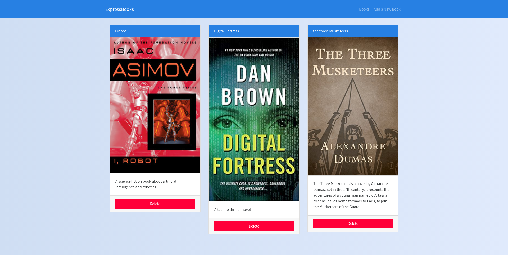

# Express Books

Express Books is Web Application to save a list of your favorite books. All data are store in a Json file.

# ScreenShoot



# Installation

```shell
git clone https://github.com/FaztTech/books-express
npm install
npm run build
npm start
```

# Environment Variables

- `PORT`, this is the http port of the server. by default is `5000`.
- `APPID` - (optional), this is an unique ID for the application to identify in a load balancer

Also you can create a .env file with the environment variables mentioned above.

# Docker

```shell
docker build -t express-books .
```

```shell
docker run -p 80:5000 express-books .
```

then visit: `http://localhost`

# Video Tutorial

- [Youtube (Spanish)](https://youtu.be/IRqaH_jhyT8)

# Considerations

- Make sure nodemon ignores the file `src/books.json`.

## Reference

- https://babeljs.io/docs/en/babel-plugin-transform-runtime

### Todo

- [ ] Add user authentication
- [ ] Allow to download the json data
- [ ] Publish a docker container image on dockerhub
- [x] Change to dark theme
